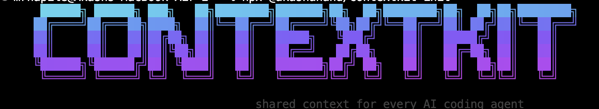

# contextkit

<div align="center">
  
</div>

<div align="center">

[](https://www.npmjs.com/package/@akashanand/contextkit)
[](https://www.npmjs.com/package/@akashanand/contextkit)

</div>

<div align="center">

**Quick install**

```bash
npx @akashanand/contextkit init
```

</div>

`contextkit` installs shared AI workflow context, skill guides, and agent-specific entrypoints into a project.

It is designed to feel like a polished terminal product:

- a branded `contextkit init` banner
- an interactive Clack flow for IDE and install scope
- per-conflict resolution with diff preview and merge support for the `AGENTS.md` skill inventory
- safe reruns with manifest tracking and overwrite-all support via `--force`

## Install and Launch

Run the command once and let the CLI guide you:

If you are in a terminal, `contextkit init` will ask which IDE you use and what install scope you want.

## What It Sets Up

By default, `init` writes:

- `AGENTS.md` at the project root
- base context docs such as `agent-context.md`, `ai-workflow-rules.md`, `architecture.md`, `code-standards.md`, `progress-tracker.md`, `project-overview.md`, and `ui-context.md`
- `.contextkit/manifest.json`
- shared skill guides in `.contextkit/skills/`
- agent-specific guidance for the selected agent targets
- the installed skill inventory inside `AGENTS.md`

## Install Modes

- `--core` installs the core skill bundle: `scope`, `architect`, `develop`, `test`
- `--scope full` installs the full base context pack
- `--scope custom --skills scope,debug` installs a custom selection
- `--scope all` installs the full base context pack and every supported skill
- `--agents codex,claude,cursor` writes agent-specific entrypoints
- `--ide codex` selects the IDE or agent profile to write
- `--all` installs every supported skill and agent target
- `--force` overwrites conflicting files
- `--dry-run` shows what would change without writing anything

## What the Interactive Flow Feels Like

1. A branded banner opens the terminal session.
2. You choose your IDE with arrow-key selection.
3. You choose the install scope.
4. If you choose custom skills, you pick them with checkboxes.
5. Conflicts are handled file by file with overwrite, skip, diff preview, or merge.

## Examples

```bash
contextkit init
contextkit init --agents codex --skills core
contextkit init --scope full --ide cursor
contextkit init --scope all --all
contextkit init --skills scope,architect,develop --force
```

## Why It Exists

The goal is to make new projects easier to hand off to AI coding agents without losing structure.

- `AGENTS.md` gives the repo a stable entrypoint
- the base context docs keep project knowledge organized
- the skill guides provide reusable workflows
- the manifest makes reruns safe and predictable

## Development

```bash
npm install
npm test
node bin/contextkit.js init --dry-run
```
